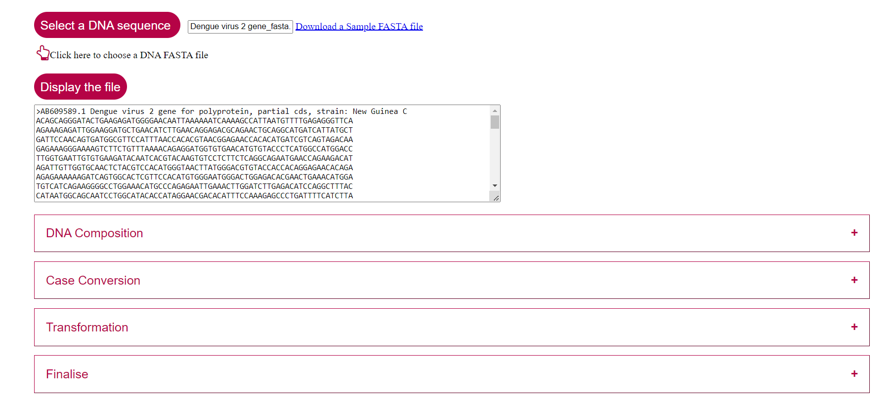

### Steps to follow for working the simulator

1.	Click the button “Select a DNA sequence”. User can select the sequence of interest in .txt format from the specific folder in personal computer. When the user select the file, the filename will be displayed in the textbox provided in the interface. 

&nbsp; 

2.	Click on “Display the file” button. The sequence will be displayed on the given textbox.

&nbsp; 

3.	User can give the inputs for all the variable buttons DNA composition, Case Conversion, and Transformation. Then click on Finalize followed by submit button to display the result. 

&nbsp; 

4.	Brief explanation of each buttons in the simulator window is discussed below. 

&nbsp; 

5.	Click on “DNA Composition” button. It has specific drop down menu to find DNA sequence composition A, T, G, C, AT-count and GC-count. User can select(click) the composition of sequence to be calculated. If the user needs to calculate  detailed count of sequence composition select option “All”. 

&nbsp; 

6.	Then click on Finalize button. Then click submit button. (When the user study each variables separately, user has to follow this step each time).

 

&nbsp; 

7.	The result will be displayed in the GUI. 
 
Result showed the AT content (%) and GC content (%) of the given sequence. Also the number of each base composition is displayed separately. The pie chart showed the percentage of each base composition in the given DNA sequence.

&nbsp; 

8.	The “Case Conversion” button has drop down choices “Uppercase” and “Lowercase”. Selection (click) of that will display the DNA sequence in either Uppercase letter mode or lowercase letter mode.
 
 

 

 
Here, in this case, lowercase is selected and the GUI displayed the sequence in lowercase. User can click on “ Download result” button and can save the file in .txt format in personal computer.

&nbsp; 

9.	The button “Transformation” included two choices; Reverse Complement and RNA. 
 

&nbsp; 

10.	If the user click on Reverse Complement, the reverse complement of the selected sequence will be displayed which can be downloaded and can be saved as .txt format.

&nbsp; 
 
11.	If the user click on RNA, specific RNA sequence is displayed which can also be downloaded and can be saved as .txt format.

&nbsp; 

12.	Click on Reset button to reset the simulator window. 

