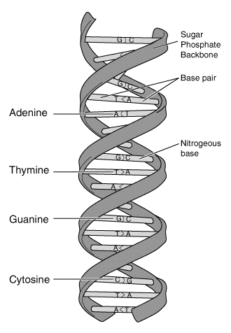

&nbsp;
## Introduction
&nbsp;

With the rapid advent of high-throughput DNA sequencing, deep insights into genomic composition are needed to understand evolutionary aspects, structural and functional properties, and organization profiles of specific genomes of interest. High-throughput next-generation and third-generation sequencing techniques have been advancing as robust methods in developing DNA sequencing technology. In order to study genomic architecture, it is important to analyze genomic nucleotide composition, which is represented as the proportion of Adenine and Thymine (Uracil in the case of RNA), and guanine and cytosine bases in the DNA molecule.  Specifically, genomic DNA base composition (GC content) is essential for predicting genome functioning and species ecology. It has been noted that the biological significance of GC content in various organisms remains unclear due to the lack of insufficient genomic data. In the interdisciplinary field of life sciences, bioinformatics research has applications in molecular and genomic sequence analysis, genome annotation, expression profiling, drug designing, and so on. Even though many web-based tools were readily available for studying the basics of the molecular process including sequence-based data analysis and visualization techniques, the lack of standardized user-friendly interfaces makes it difficult for users to learn how to use the tools, and to translate the given data formats from one format to another; therefore study of sequence composition in a given biological sequence be a difficult task for beginners and biologists. 

The purpose of this experiment is to provide a user-interactive platform for facilitating the computation of nucleotide composition within a given sequence.

&nbsp;

## Theory
&nbsp;

All organisms have genetic material, the hereditary substance in the cell, which is stored either in the nucleus of eukaryotes (plants and animals) or in the cytoplasm of prokaryotic organisms (bacteria). In some cases, the genetic material is found in the extracellular sites such as mitochondria and chloroplast.  It functions to carry all the necessary information specific to an organism. Generally, the genetic material of a cell can either be a gene or a group of genes or conserved in molecules called nucleic acids which is a DNA (Deoxyribonucleic Acid) or RNA (Ribonucleic Acid) molecules. Nucleotides are the building blocks for nucleic acids, which are of five types are of five types namely Adenine (A), Cytosine (C), Guanine (G), Thymine (T), and Uracil (U). A nucleotide is composed of three components (Phosphate group, Ribose sugar, and Nitrogenous base) which are linked together. Depending on the type of the nitrogenous base, it is classified as purines (two rings: G, A) and pyrimidines (one ring: C, U, T). Ribose sugar and nitrogenous bases differ in DNA and RNA. Briefly, DNA and RNA molecules are polymers that are made up of long chains of nucleotides.

&nbsp;

### Deoxyribonucleic acid
&nbsp;

DNA is the hereditary material that carries information and functions in the growth of organisms and replication processes. It is noted that a basic understanding of DNA composition is a key factor in the structure and function prediction of longer biological relevant molecules that transfers genetic information from generation to generation. The x-ray diffraction analysis of DNA in the early 1950’s revealed DNA composition as two polymer strands coiled into a helix. In humans, the genetic material is seen in the form of double-stranded DNA molecules with a double helical structure, containing a sequence of nucleotides to form two DNA strands. In general, DNA has two long complementary double-helical strands with different combinations composed of four nucleotide subunits (guanine (G), cytosine (C), adenine (A), and thymine (T) (Fig.1). The polynucleotide strand consists of a nitrogenous base, deoxyribose sugar and a phosphate group. The nucleotide is named depending on the nitrogenous base. The sugar is deoxyribose in DNA.

Even though it is stated that the most common form of DNA is a double helix, there is scientific evidence of branched DNA, quadruplex DNA, and DNA with triple strands while studying molecular and topological features in nucleic acid research. 

&nbsp;

Fig.1. Diagrammatic representation of DNA. The figure depicts the base composition, sugar and phosphate backbone and hydrogen bonding with the base pairs.

&nbsp;

Image source: https://en.wikipedia.org/wiki/Molecular_Structure_of_Nucleic_Acids:_A_Structure_for_Deoxyribose_Nucleic_Acid#/media/File:DNA-structure-and-bases.png

&nbsp;

The two strands of the DNA are anti-parallel in nature where the 3′ end of one strand faces the 5′ end of the other strand.

&nbsp;

Example of a DNA sequence in FASTA format
>AK038513.1 Mus musculus adult male hypothalamus cDNA, RIKEN full-length enriched library, clone: A230021I18 product:Potassium channel ERG2 (FRAGMENT) homolog [Ratus ratus], full insert sequence

GACTTATGTACGCCAGCATCTTTGGCAACGTGTCGGCCATCATCCAGCGCCTGTACTCAGGCACGGCTCG
CTACCACACTCAGATGCTGCGGGTCAAGGAGTTCATCCGCTTCCACCAGATCCCCAACCCACTGAGGCAG
CGCCTGGAAGAGTATTTCCAGCACGCCTGGTCCTACACCAATGGCATCGACATGAACGCGGTGCTGAAAG
GCTTCCCTGAGTGCCTGCAGGCGGACATCTGCCTGCACCTGCACCGCGCTCTGTTGCAGCACTGCCCCGC
CTTCCGCGGCGCCAGCAAGGGGTGCCTGCGCGCGCTCGCCGTCAAGTTCAAGACCACGCACGCGCCGCCT
GGGGACACGCTGGTGCACCTGGGCGACGTGCTTTCCACTCTCTACTTCATCTCCCGCGGCTCCATCGAGA
TCCTGCGCGATGACGTGGTCGTGGCCATTCTAGGGAAGAATGACATCTTTGGGGAGCCTGCCAGTCTCCA
TGCCAGACCAGGCAAATCAAGCGCCGATGTGCGTGCCCTGACCTACTGCGACCTGCACAAGATCCATCGA
GCAGACCTGCTGGAGGTGCTGGACATGTACCCCGCCTTTGCAGATACCTTCTGGAATAAGCTAGAGGTCA

&nbsp;

A reverse complement of a DNA sequence is obtained by reversing the base pairs order, followed by interchanging A and T and interchanging C and G. 
For example, the reverse complement of ACCTGAG is CTCAGGT.

&nbsp;

### Chargaff's rules

 In 1952, Elson Chargaff, an Austrian chemist, proposed a rule that the DNA of any cell, organism, or species should possess pyrimidine and purines in a 1:1 ratio. This indicates that the amount of guanine in a DNA is always equal to the amount of cytosine, similarly, the amount of adenine is equal to the amount of thymine. Adenine pairs with thymine to form a base pair with 2 hydrogen bonds (A=T), and Guanine pairs with the complementary cytosine to form a base pair with three forming hydrogen bonds (G ≡ C). Based on this hydrogen bonding property, A and T form the weakest bond, and G and C form the strongest bond.

A series of rules related to DNA structure and stability introduced by Chargaff is known as Chargaff’s parity rules. According to the rule, a double-stranded DNA possesses a percentage of base pair equality. That means %A in a DNA = %T in a DNA and the same case with %G and  %C in a sequence. This rule is in validation with the basis of DNA structure proposed by Watson and Crick. The rule related to the global base pairing composition of DNA in a single strand indicates that %A ~ %T and %G ~ %C is valid for each of the two DNA strands. The difference in the percentage of nitrogenous bases in different organisms resulted in variations of species. 

&nbsp;

### Ribonucleic acid

RNA is the genetic material and carrier of genetic codes in some viruses that replaces DNA molecules. Ribose is the sugar in RNA, and the nitrogenous bases in RNA are adenine, guanine, cytosine, and uracil, which replace thymine in DNA. RNA is a single-stranded helix molecule with shorter chains of nucleotides. RNA functions to code for amino acids thereby acting as a messenger between DNA and ribosomes during the translation process to make proteins.

&nbsp;

### Quadruplex DNA

DNA or RNA sequences rich in Guanine base tend to fold into four strands with hydrogen bonds leading (quadruple helix structure) to non-canonical secondary structures termed as G-quadruplexes (G4s). G4 structures in the context of genomic DNA were noted thoroughly after the analysis of the crystal structure of a G4 formed by the human telomeric DNA sequence. Studies reported the importance of G4s in genetic functions such as transcription and replication, understanding the stability of the genome, and studying epigenetic features of the genome. 

In a broader sense, G4s are promising for the following mechanisms.

1.	For studying the processes and control mechanisms in cancer biology.

2.	Target for drug discovery in cancer, aging, and neurological diseases.

&nbsp;

### Genomic Composition and its implications

1.	GC-rich regions have pivotal importance in techniques like PCR or DNA sequencing.

2.	It has been revealed that sequence with higher GC content has higher thermal stability than adenine: thymine pairs.
GC content Calculation equation:  (G + C / A + T + G + C) * 100%
For calculating the ratio of AT/GC, use the equation: A + T/ G + C

3.	G +C rich regions are prone to liable mutation.

4.	 GC content has a specific role in evolutionary genomics.

### Pedagogical Aspects

•	User can count both percentage of AT and GC and number/percentage wise distribution of A, T, G.C from the FASTA format of the nucleotide sequence.

•	User can convert the sequence to Uppercase/Lowercase depending on the purpose of the study.

•	Can obtain the Reverse Complement and the corresponding RNA sequence. 

&nbsp;

The present simulator modified to identify

1. Easy accessibility of DNA sequence composition.

2. Conversion of DNA sequence into its reverse complement as well as RNA in a single platform 

3. User-friendly approach in the total composition of DNA to identify its stability. 

